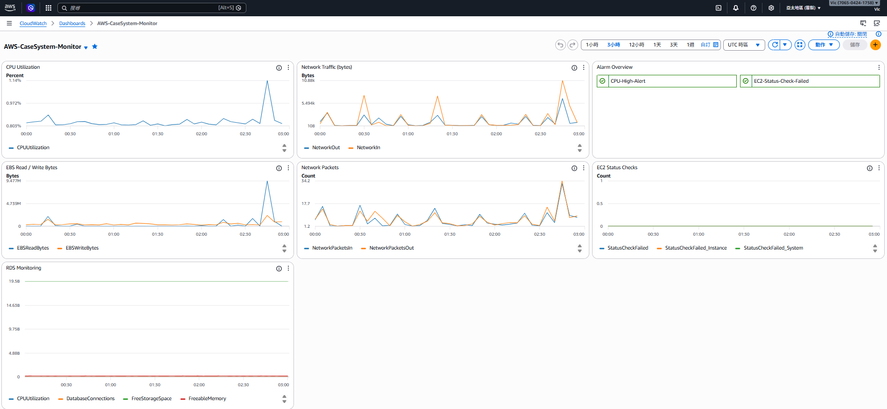

# AWS 雲端內部案件管理系統

**AWS Internal Case Management System**

> 一套以真實內部案件流程為基礎設計的雲端管理系統，  
> 整合案件提報、處理協作、權限控管、附件管理、站內通知、狀態追蹤與基礎維運監控。  
> 系統採用 Flask 開發，部署於 AWS EC2，並結合 RDS、S3、CloudWatch、SNS、Nginx、Gunicorn 與 HTTPS 網域環境。

---

## 目錄

- [專案簡介](#專案簡介)
- [專案動機](#專案動機)
- [專案定位](#專案定位)
- [系統功能](#系統功能)
- [系統架構](#系統架構)
- [技術棧](#技術棧)
- [系統畫面展示](#系統畫面展示)
- [CloudWatch 監控與維運](#cloudwatch-監控與維運)
- [CI/CD 自動部署](#cicd-自動部署)
- [Health Check 與維運設計](#health-check-與維運設計)
- [HTTPS / SSL 部署](#https--ssl-部署)
- [Backup / Recovery 設計](#backup--recovery-設計)
- [部署資訊](#部署資訊)
- [本機開發環境設定](#本機開發環境設定)
- [專案結構](#專案結構)
- [專案亮點](#專案亮點)
- [作者](#作者)

---

## 專案簡介

本專案是一套以真實工作情境為基礎發想的內部案件管理系統，  
聚焦於案件提報、案件處理、狀態追蹤、留言協作、附件整合、站內通知與權限控管等核心需求。

系統依角色區分權限範圍：

- **Submitter（業務）**：提交案件、查看自己案件、追蹤進度
- **Agent（客服）**：查看全部案件、更新狀態、留言協作、處理案件
- **Admin（主管）**：完整權限、KPI 報表、管理使用者

本專案整合 AWS EC2、RDS、S3、CloudWatch、SNS 等服務，  
完成從需求發想、資料庫設計、功能開發到雲端部署與基礎維運監控的實作流程。

---

## 專案動機

在實際工作情境中，第一線客服與業務的案件回報流程，常透過 Google 表單提交、Google 試算表追蹤進度。  
雖能完成基本紀錄，但在角色權限分流、案件狀態管理、留言協作、附件整合與歷程追蹤上，仍有整合與優化空間。

因此，我以真實內部協作流程為出發點，獨立設計並實作此系統，  
希望將原本分散的提報、處理與追蹤流程整合為單一平台。

---

## 專案定位

本專案為依真實工作情境延伸、自主規劃與實作的個人專題。
除了功能開發外，也著重於角色權限設計、案件流程拆解、雲端部署、監控告警與基本維運設計，
作為驗證自己在系統開發與維運方向能力的實作成果。

---

## 系統功能

### 角色權限控管（RBAC）

| 角色 | 說明 |
|------|------|
| Submitter（業務） | 提交案件、查看自己的案件、新增外部留言 |
| Agent（客服） | 處理所有案件、新增內外部留言、更新狀態 |
| Admin（主管） | 全部權限 + KPI 報表 + 管理使用者 |

### 案件管理

- 工單建立與追蹤
- 狀態管理（待處理 / 處理中 / 待追蹤 / 已結案）
- 問題分類與優先級設計
- 歸還點數狀態標記
- 附件上傳（整合 S3 Presigned URL）
- 留言協作（外部留言 / 內部備註）
- 狀態歷程紀錄

### 管理功能

- Admin KPI 報表（各客服已結案件數量統計）
- 問題分類圓餅圖（含日期區間篩選）
- 使用者管理

### 站內通知系統

- 導覽列鈴鐺圖示，即時顯示未讀通知紅點
- 新案件建立後通知 Agent / Admin
- 案件狀態更新後通知 Submitter
- 新增留言後通知相關人員
- 歸還點數狀態更新後通知 Submitter
- 通知分類標籤（新案件 / 狀態更新 / 新留言 / 歸還點數）
- 點擊通知可跳轉對應案件
- 一鍵全部已讀
- 通知中心頁面可查看完整歷史通知

---

## 系統架構


### 架構說明

系統採用 AWS 雲端部署，主要架構如下：

- 使用者透過瀏覽器以 **HTTPS** 存取系統
- 外部請求先進入 EC2 上的 **Nginx**
- Nginx 負責 **HTTP 轉 HTTPS** 與 **SSL Termination**
- Nginx 反向代理至 **Gunicorn**
- Gunicorn 執行 **Flask Web Application**
- 應用程式連接 **Amazon RDS MySQL**
- 附件檔案透過 **Amazon S3 Presigned URL** 上傳
- 主機與資料庫監控透過 **Amazon CloudWatch**
- 異常告警透過 **Amazon SNS** 發送通知
- CI/CD 透過 **GitHub Actions** 自動部署至 EC2

### AWS 服務架構

```text
使用者（Browser）
        │ HTTPS 443
        ▼
  Nginx（Reverse Proxy / SSL Termination）
        │
        ▼
  Gunicorn（內部 port 5000）
        │
        ▼
  Flask Web Application
     ├─ Amazon RDS MySQL
     ├─ Amazon S3（Presigned URL）
     ├─ Amazon CloudWatch
     └─ Amazon SNS

GitHub Actions
        │ SSH Deploy
        ▼
      Amazon EC2
```

---

## 技術棧

| 類別 | 技術 |
|------|------|
| 後端 | Python Flask |
| WSGI 伺服器 | Gunicorn |
| 本機開發 / 測試 | Docker / Docker Compose |
| 資料庫 | Amazon RDS MySQL 8.4 |
| 檔案儲存 | Amazon S3（Presigned URL） |
| 伺服器 | Amazon EC2 t3.micro（Ubuntu 24.04） |
| 反向代理 | Nginx |
| 服務管理 | systemd |
| 權限控管 | AWS IAM Role / Policy |
| 網路 | AWS VPC / Public & Private Subnet / Security Group |
| 監控 | Amazon CloudWatch + Amazon SNS |
| SSL | Let's Encrypt + Certbot |
| 版本控管 | Git / GitHub |
| CI/CD | GitHub Actions |

---

## 系統畫面展示

### Submitter（業務）

#### 1. 登入後首頁
說明：顯示登入者資訊、角色權限、快捷操作與案件統計；Submitter 僅可查看自己提報的案件。


#### 2. 案件列表
說明：支援案件列表查詢、狀態篩選、關鍵字搜尋與問題類別占比圖表，方便業務快速追蹤自己提報的案件。


#### 3. 新增案件
說明：提供案件提報入口，支援案件標題、問題類別、學員資訊、Tutor、案件內容說明、附件上傳與是否歸還點數等欄位。


#### 4. 自動優先級判斷
說明：依問題類別自動帶出建議優先級，減少提交者判斷負擔，並讓客服能快速辨識需要優先處理的案件。


#### 5. 案件明細
說明：可查看案件基本資料、附件、留言記錄與狀態歷程，完整呈現案件處理過程。


---

### Agent（客服）

#### 1. 登入後首頁
說明：客服角色可查看全部案件，並透過首頁快速進入案件列表與處理流程。


#### 2. 案件列表
說明：客服可查看全部案件，並透過篩選與搜尋快速定位案件，協助案件分流與追蹤。


#### 3. 案件明細與處理功能
說明：客服可於案件明細頁更新案件狀態、調整是否歸還點數，並新增內部備註或對外留言。


#### 4. 站內通知提醒
說明：新案件、新留言等事件會透過站內提醒通知客服，降低漏接案件風險。


---

### Admin（主管）

#### 1. 登入後首頁
說明：主管角色除可查看全部案件外，另提供 KPI 報表等管理功能入口。


#### 2. KPI 報表
說明：主管可依日期區間查看客服人員已結案件數量統計，作為追蹤處理量與管理參考。


#### 3. 案件明細與內部資訊
說明：主管可查看案件明細與客服端可見的內部備註資訊，作為案件追蹤、溝通與管理參考；此類內部資訊不對提交者（業務）開放。


---

## CloudWatch 監控與維運

本專案使用 Amazon CloudWatch 建立 **AWS-CaseSystem-Monitor** 儀表板，  
集中追蹤主機與資料庫的關鍵指標，提升服務可觀測性與基礎維運能力。

### 儀表板監控項目

- CPU Utilization：主機 CPU 使用率趨勢
- Network Traffic：NetworkIn / NetworkOut 流量
- EBS Read / Write Bytes：磁碟讀寫負載
- EC2 Status Checks：系統層與執行個體層健康狀態
- Alarm Overview：告警狀態總覽

### 告警設定

- `CPU-High-Alert`：CPU 使用率超過閾值時觸發
- `EC2-Status-Check-Failed`：EC2 狀態檢查失敗時觸發
- 整合 Amazon SNS，異常發生時自動發送 Email 通知


### RDS 監控項目

本專案另於 CloudWatch Dashboard 補充 RDS 監控指標，  
從資料庫層面掌握後端服務狀態。

| 指標 | 說明 |
|------|------|
| CPUUtilization | RDS 執行個體 CPU 使用率 |
| DatabaseConnections | 目前資料庫連線數 |
| FreeStorageSpace | 剩餘儲存空間 |
| FreeableMemory | 可用記憶體大小 |



---

## CI/CD 自動部署

本專案導入 GitHub Actions 建立自動部署流程，讓程式碼 push 後可自動部署至 AWS EC2，降低手動更新造成的遺漏與版本不一致問題。

### 部署流程

1. 開發完成後將程式碼 push 至 GitHub `main` 分支
2. GitHub Actions workflow 自動觸發
3. Workflow 透過 SSH 連線至 EC2
4. EC2 端執行 `git pull origin main` 取得最新版本
5. 執行 `sudo systemctl restart aws-ticket` 重新啟動應用服務
6. 部署完成後，可透過 `/health` 端點確認應用程式、RDS 與 Amazon S3 狀態是否正常

### 敏感資訊管理

部署所需連線資訊透過 GitHub Secrets 管理，不寫死於程式碼中：

| Secret 名稱 | 說明 |
|-------------|------|
| EC2_HOST | EC2 Elastic IP |
| EC2_USER | SSH 登入使用者名稱 |
| EC2_SSH_KEY | PEM 私鑰內容 |

### 設定檔位置

`.github/workflows/deploy.yml`

---

## Health Check 與維運設計

本專案提供 `/health` 健康檢查端點，回傳 JSON 格式，  
同時確認應用程式、資料庫與檔案儲存服務的連線狀態，  
方便部署後驗證、監控整合與日常維運使用。

### 回傳範例

```json
{"db":"connected","s3":"connected","status":"ok"}
```

### 檢查項目

| 項目 | 說明 |
|------|------|
| status | Flask 應用程式是否正常運作 |
| db | RDS MySQL 連線是否正常 |
| s3 | Amazon S3 儲存服務是否可正常存取 |

### 用途

- 部署後快速確認服務是否正常上線
- 可作為 CI/CD 部署完成後的驗證端點
- 可搭配外部監控工具定期呼叫做存活檢查
- 協助快速區分問題發生在應用程式、資料庫或檔案儲存層

### 目前維運設計整體架構

| 元件 | 角色 |
|------|------|
| Nginx | 統一接收外部流量，處理 HTTPS 與反向代理 |
| Gunicorn | WSGI Server，承接 Flask 應用服務 |
| systemd | 管理服務啟動與重啟，降低異常中斷風險 |
| CloudWatch | 集中查看主機與資料庫指標 |
| SNS | 告警觸發時發送 Email 通知 |
| IAM Role | 讓 EC2 安全存取 AWS 資源，避免長期金鑰暴露 |
| /health | 應用層健康檢查，同時驗證 DB 與 Amazon S3 連線 |

---

## HTTPS / SSL 部署

本專案已完成正式 HTTPS 部署，網站可透過自訂網域安全存取：

- 網域：`vic-ticket.duckdns.org`
- 存取網址：`https://vic-ticket.duckdns.org`
- Reverse Proxy：Nginx
- SSL 憑證：Let's Encrypt
- 憑證管理工具：Certbot
- 自動續約：已設定

### 部署方式

- 使用 DuckDNS 綁定自訂網域至 EC2 Elastic IP
- 由 Nginx 接收外部 `80 / 443` 請求
- 將 HTTP 自動導向 HTTPS
- 由 Nginx 終止 SSL，並反向代理至內部 Gunicorn / Flask 服務

### 設計價值

- 提升資料傳輸安全性
- 建立較接近正式環境的對外存取方式
- 搭配 Certbot 自動續約，降低憑證過期風險

---

## Backup / Recovery 設計

在維運設計上，本專案同時考慮資料備份與異常後的復原需求。

### 資料備份設計

本專案的資料主要分為兩類：

**結構化資料**

案件、留言、通知、使用者等資料儲存在 Amazon RDS MySQL，啟用自動備份與 KMS 加密。

**附件資料**

案件附件儲存在 Amazon S3，透過 Presigned URL 上傳，與主機本身解耦，降低 EC2 磁碟負擔。

### Recovery 思維

| 異常情境 | 對應處理方式 |
|----------|-------------|
| 應用服務異常 | systemd 自動重啟服務 |
| 主機異常 | 重新部署應用程式並接回 RDS / S3 |
| 資料庫層異常 | 依 RDS 自動備份機制進行還原 |
| 附件資料異常 | 由 S3 集中管理，不受應用程式重啟影響 |

### 設計價值

- 應用程式、資料庫、附件儲存三層分離
- 主機故障時資料不隨之消失
- 可避免附件與資料庫綁定在單一主機上，降低 EC2 異常時的資料風險
- 符合「應用層 / 資料層 / 儲存層分離」的維運思維
- 有利於後續擴充、搬遷與災難復原規劃

---

## 部署資訊

| 項目 | 說明 |
|------|------|
| 雲端平台 | AWS ap-southeast-2（Sydney） |
| EC2 | t3.micro / Ubuntu 24.04 / Elastic IP |
| 網域 / 存取方式 | `https://vic-ticket.duckdns.org` |
| 反向代理 | Nginx |
| WSGI | Gunicorn |
| 資料庫 | Amazon RDS MySQL（Private Subnet，port 3306） |
| SSL 憑證 | Let's Encrypt（Certbot 自動續約） |
| 備份 | RDS 自動備份啟用 / KMS 加密 |
| 儲存 | Amazon S3 `vic-ticket-attachments` |

> 線上展示環境可能因部署調整或成本控管暫時關閉，若無法連線，請以 GitHub 原始碼、系統架構圖與畫面截圖為主。

---

## 本機開發環境設定

```bash
# 1. clone 專案
git clone https://github.com/viclin822/aws-internal-case-management-system.git
cd aws-internal-case-management-system

# 2. 建立虛擬環境
python -m venv venv
source venv/bin/activate  # Windows: venv\Scripts\activate

# 3. 安裝依賴
pip install -r requirements.txt

# 4. 設定環境變數
cp .env.example .env

# 5. 啟動應用
python app.py
```

> `.env` 需自行填入資料庫、Amazon S3 與 AWS 相關設定，請參考 `.env.example`。

### Docker 啟動（選用）

```bash
docker compose up --build
docker compose up --build -d
```

---

## 專案結構

```text
aws-internal-case-management-system/
├── app.py
├── requirements.txt
├── Dockerfile
├── docker-compose.yml
├── .env.example
├── .gitignore
├── logs/
├── templates/
│   ├── base.html
│   ├── index.html
│   ├── ticket_list.html
│   ├── ticket_detail.html
│   ├── create_ticket.html
│   ├── edit_ticket.html
│   ├── notifications.html
│   └── admin_stats.html
└── docs/
    ├── architecture.png
    ├── cloudwatch-dashboard.png
    ├── cloudwatch-rds-dashboard.png
    ├── submitter-dashboard.png
    ├── submitter-ticket-list.png
    ├── submitter-create-ticket.png
    ├── submitter-priority-logic.png
    ├── submitter-ticket-detail.png
    ├── agent-dashboard.png
    ├── agent-ticket-list.png
    ├── agent-ticket-detail.png
    ├── agent-notifications.png
    ├── admin-dashboard.png
    ├── admin-kpi-report.png
    └── admin-ticket-detail.png
```

---

## 專案亮點

- 以真實工作場景為基礎發想，而非單純練習型題目
- 實作 Submitter / Agent / Admin 三角色權限設計
- 完成案件建立、追蹤、留言、通知、歷程記錄等完整流程
- 整合 Amazon EC2、RDS、S3、CloudWatch、SNS 完成雲端部署
- 使用 Nginx + Gunicorn + Flask 建立正式部署架構
- 導入 HTTPS / SSL（Let's Encrypt + Certbot）提升服務安全性
- 導入 CloudWatch 與 SNS 建立監控儀表板與自動化告警機制
- 導入 GitHub Actions 實現 push 觸發自動部署至 EC2
- 提供 `/health` 端點同時檢查 DB 與 Amazon S3 連線狀態
- 具備從需求分析、資料庫設計、後端開發、部署到維運的完整實作流程

---

## 作者

**Vic Lin（林峻毅）**  
國立臺北商業大學 資訊管理系  
緯育 TibaMe AWS 雲端工程師培訓  
GitHub：[@viclin822](https://github.com/viclin822)
